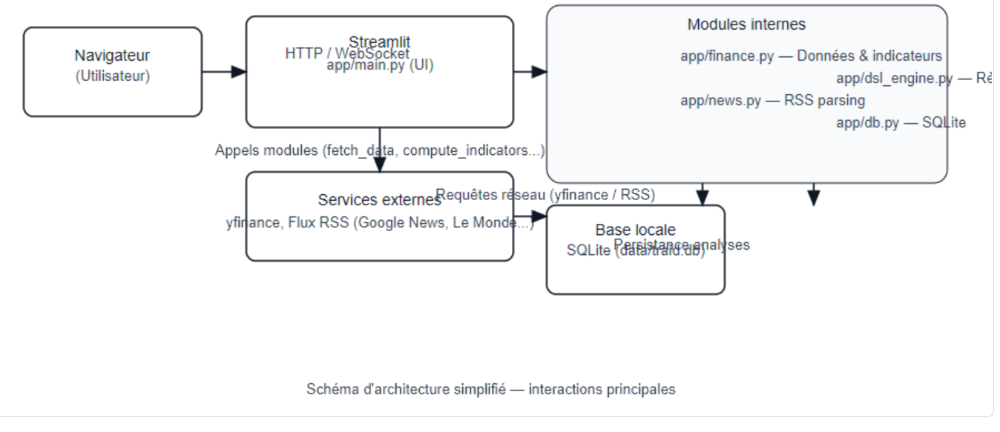
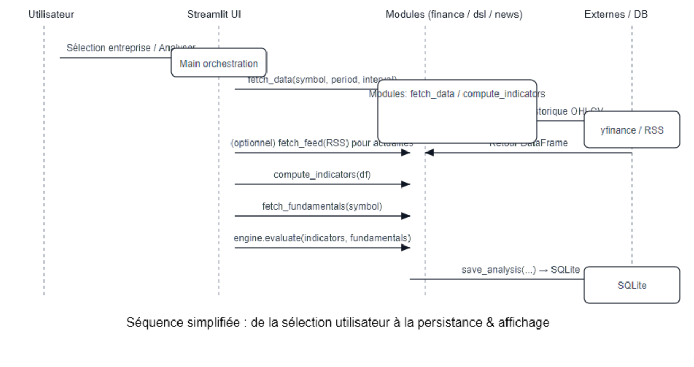

# Document de Conception Projet (DCP)

**Titre :** Traid — Analyseur automatique (yfinance)

**Date :** 2025-11-26

**Auteur :** Équipe / groupe_1

**Version :** 1.0

---

## 1. Contexte et objectif

L'application "Traid" est une application web légère (Streamlit) conçue pour :
- Récupérer des données de marché (historique OHLCV) via `yfinance`.
- Calculer des indicateurs techniques (RSI, ADX, MACD, moyennes mobiles, Bollinger Bands, signaux chandelier) et indicateurs dérivés.
- Évaluer des règles métier définies via un petit DSL (moteur `DSLEngine`) pour produire des décisions (BUY / SELL / HOLD) et raisons.
- Afficher un tableau de bord interactif (graphique Plotly, cartes de score, métriques, conseils).
- Enregistrer l'historique des analyses dans une base SQLite.
- Agréger des flux d'actualité (RSS) pertinents pour les entreprises analysées.

Le DCP détaille l'architecture, les composants, les flux de données, l'installation, l'exploitation et l'évolution souhaitée.

## 2. Périmètre

Inclus :
- Backend léger en Python (bibliothèques : Streamlit, yfinance, pandas, pandas_ta, feedparser, plotly).
- Interface Streamlit unique (`app/main.py`).
- Modules de logique : `app/finance.py`, `app/news.py`, `app/dsl_engine.py`, `app/db.py`.
- Stockage local SQLite (pas de service externe requis).

Exclu :
- Authentification/gestion d'utilisateurs multi-comptes.
- Déploiement cloud automatisé (sauf instructions de base pour hébergement).

## 3. Exigences fonctionnelles (résumé)

- RF1 : Choisir une entreprise (liste limitée aux 5 entreprises françaises) et afficher l'analyse.
- RF2 : Télécharger automatiquement les données historiques yfinance selon période & intervalle.
- RF3 : Calculer indicateurs techniques et résumer via scores 0..5.
- RF4 : Évaluer règles DSL et produire décision + raisons.
- RF5 : Afficher graphique interactif (candlestick + indicateurs).
- RF6 : Afficher actualités par entreprise (flux RSS Google News / sites français).
- RF7 : Persister chaque analyse dans SQLite (timestamp, symbole, décision, indicateurs, fondamentaux).
- RF8 : Option "Analyse automatique" pour lancer à chaque chargement/sélection.

## 4. Exigences non-fonctionnelles

- NFR1 : Temps de réponse raisonnable (< 10s pour période courte, dépend du réseau yfinance).
- NFR2 : Résilience : gérer erreurs réseau et afficher messages utiles sans casser l'UI.
- NFR3 : Portable : exécutable sous Windows/macOS/Linux avec un environnement Python virtuel.
- NFR4 : Simplicité d'installation via `requirements.txt`.

## 5. Architecture logicielle (haut niveau)

- UI/Présentation : `app/main.py` (Streamlit).  
- Services/domain logic :
  - `app/finance.py` — récupération des prix, calcul d'indicateurs.
  - `app/dsl_engine.py` — parse & exécution des règles DSL (fichier `app/rules.dsl`).
  - `app/news.py` — récupération et nettoyage des flux RSS.
  - `app/db.py` — initialisation et accès SQLite (insert/retrieve analyses).
- Persistant : `data/traid.db` (SQLite) — schéma simple (voir section DB).
- Dépendances externes : `yfinance`, `feedparser`, `pandas`, `pandas_ta`, `plotly`, `streamlit`.

Diagramme textuel :

User Browser <--> Streamlit app (`app/main.py`) <--> finance/news/dsl/db modules

## 6. Détail des composants

### 6.1 `app/main.py` (UI)
Responsabilités :
- Contrôles de la sidebar (sélection entreprise, période, intervalle, options d'affichage).
- Orchestration : appel `fetch_data`, `compute_indicators`, `fetch_fundamentals`, `engine.evaluate`, `save_analysis`.
- Rendu : score cards, graphiques Plotly, expanders (conseils, fondamentaux, actualités, historique).
- Caching/optimisation : `st.cache_data` / `st.cache_resource` pour fonctions couteuses.

Points d'attention :
- Afficher messages d'erreurs réseau ou d'absence de données.
- Limiter fréquence d'appels externes (yfinance) via cache et slider de rafraîchissement.

### 6.2 `app/finance.py`
Responsabilités :
- `fetch_data(symbol, period, interval)` : retourne DataFrame pandas avec colonnes `Open,High,Low,Close,Volume`.
- `compute_indicators(df)` : calcule RSI, MACD, ADX, DI+, DI-, moyennes mobiles (SMA20/SMA50), Bollinger Bands, signaux chandelier simples. Retourne dict d'indicateurs.
- `fetch_fundamentals(symbol)` : récupère métadonnées via yfinance (market cap, PE, dividend, etc.).

Bonne pratique : incrémenter validation (ex: vérifier taille df, valeurs NaN) et capturer exceptions réseau.

### 6.3 `app/dsl_engine.py`
Responsabilités :
- Charger le fichier DSL (`app/rules.dsl`).
- Parser les règles (format simple : nom, expression, commentaire, poids). Exemple : "RSI < 30 => BUY".
- Exécuter règles contre le contexte `indicators` + `fundamentals` et retourner : décision (BUY/SELL/HOLD), liste `triggered` avec meta.

Design notes :
- Utiliser `asteval` ou un mini-interpréteur sûr pour évaluer expressions.
- Valider/normaliser les valeurs d'entrée pour éviter injections.

### 6.4 `app/news.py`
Responsabilités :
- `fetch_feed(url, max_items=6)` : utilise `feedparser` pour parser RSS/Atom.
- Nettoyage : `_strip_html` pour enlever tags, entités, normaliser espaces.
- Normaliser la date publiée si possible (UTC localisé).
- Retourne liste d'items `{title, link, summary, published}`.

Points d'attention :
- Google News RSS renvoie parfois des liens de redirection (`news.google.com/rss/articles/...`) ; il est acceptable de laisser ces liens, ou d'implémenter une résolution via une requête HEAD suivie de la redirection (attention aux performances et aux politiques CORS si client-side).
- Certains flux peuvent être vides ou bloqués; afficher des messages de debug en UI (URL + count) pour aider le diagnostic (déjà ajouté en debug).

### 6.5 `app/db.py`
Responsabilités :
- `init_db()` : créer tables si nécessaire.
- `save_analysis(symbol, decision, reason, indicators, fundamentals)` : insérer en JSON les snapshots.
- `get_history(limit)` : lire les dernières analyses.

Schéma recommandé :
- `analyses` (id INTEGER PK AUTOINCREMENT, ts TIMESTAMP, symbol TEXT, decision TEXT, reason TEXT, indicators JSON, fundamentals JSON)

## 7. Flux de données et séquences

Cas d'usage principal (Analyse d'une entreprise) :
1. L'utilisateur sélectionne une entreprise et clique sur "Analyser" (ou `auto_analyze` true).
2. `app/main.py` appelle `fetch_data(symbol, period, interval)`.
3. Récupération -> DataFrame -> `compute_indicators(df)`.
4. `fetch_fundamentals(symbol)` récupère métadonnées.
5. `engine.evaluate(indicators, fundamentals)` calcule décision et raisons.
6. Sauvegarde via `save_analysis(...)`.
7. UI met à jour : graphique Plotly + cartes de score + expander actualités (appelle `fetch_feed` pour chaque entreprise). 

## 8. UI / UX (écrans & composants)

- Sidebar : paramètres (période, intervalle, toggles d'affichage, entreprise).
- Zone gauche : carte prix + petites métriques + scores 0–5 + recommandation + expander conseils & fondamentaux.
- Zone droite : graphique interactif (Plotly) avec OHLC, SMA/BB, volume, annotations H&S.
- Bas : historique des analyses, expander actualités (par entreprise) avec titres cliquables et résumé.

Accessibilité : police lisible, contraste élevé (thème clair par défaut), boutons/toggles sur sidebar.

## 9. Gestion des erreurs & logging

- Tous les appels réseau (yfinance, feedparser) doivent être entourés d'un try/except et afficher un message utilisateur (st.error / st.info) sans interrompre l'app.
- Ajouter logs locaux (logging module) au niveau DEBUG/INFO write-to-file optionnel dans `logs/traid.log`.
- Utiliser `st.exception` ou un bloc d'erreur condensé pour débogage.

## 10. Sécurité & vie privée

- Aucune donnée privée n'est collectée côté serveur sauf les analyses stockées localement.
- Ne pas exécuter d'expressions DSL non-sanitized : limiter le langage et utiliser un interpréteur sûr.
- Attention aux liens externes dans les flux : n'ouvrir que via le navigateur client (liens `target=_blank` si HTML rendu). Pas d'exécution de code distant.

## 11. Schéma de la base de données (exemple)

CREATE TABLE analyses (
  id INTEGER PRIMARY KEY AUTOINCREMENT,
  ts TEXT NOT NULL,
  symbol TEXT NOT NULL,
  decision TEXT,
  reason TEXT,
  indicators TEXT, -- JSON
  fundamentals TEXT -- JSON
);

## 12. Dépendances & environnement

Fichier : `requirements.txt` (exemple) :
- streamlit
- yfinance
- pandas
- pandas_ta
- plotly
- feedparser
- asteval

Installation (Windows / PowerShell) :
```powershell
python -m venv .venv
.venv\Scripts\Activate.ps1
python -m pip install -r requirements.txt
```
Lancement :
```powershell
.venv\Scripts\Activate.ps1
python -m streamlit run app\main.py --server.port 8501
```

## 13. Tests & validation

- Tests unitaires recommandés (pytest) pour :
  - `app/finance.py` : fonctions de calcul d'indicateurs (valeurs connues sur séries factices).
  - `app/news.py` : nettoyage HTML et parsing d'exemple de flux (fixtures).
  - `app/dsl_engine.py` : parser & évaluateur sur cas simples et cas limite.
- Tests d'intégration manuels : démarrer l'app et vérifier workflow complet.

## 14. CI / CD (suggestion)

- GitHub Actions pipeline :
  - Linter (flake8 / ruff), pytest runs, sécurité (bandit).
  - Optionnel : déploiement sur Streamlit Cloud ou VM (déployer artifact : `requirements.txt` + app).

## 15. Observations et améliorations futures

- Résolution des liens Google News : ajouter une étape facultative pour suivre les redirections et extraire URL finale, mais attention aux performances et chargement multiple.
- Cacher/agréger flux côté serveur pour réduire appels multiples.
- Ajouter authentification + rôles pour multi-utilisateurs et tableaux de bord privés.
- Ajouter tests automatisés et couverture.
- Remplacer SQLite par Postgres pour multi-user / scaling si nécessaire.
- Ajouter exporter PDF/rapport d'analyse.

## 16. Liste des fichiers clés

- `app/main.py` — UI Streamlit (orchestration)
- `app/finance.py` — récupération & indicateurs
- `app/dsl_engine.py` — moteur de règles
- `app/news.py` — RSS parsing & cleaning
- `app/db.py` — persistence SQLite
- `requirements.txt` — dépendances
- `app/rules.dsl` — règles métier (DSL)
- `docs/DCP_Traid.md` — ce document

## 19. Schémas et diagrammes

Pour clarifier l'architecture et le flux principal de l'application, deux schémas ont été ajoutés dans le dossier `docs/` :

- `architecture.svg` — Schéma d'architecture simplifié montrant les composants principaux (navigateur, Streamlit, modules internes, services externes, base SQLite).
- `sequence.svg` — Diagramme de séquence simplifié couvrant le cas d'usage "Analyser une entreprise" (sélection → récupération données → calcul indicateurs → évaluation règles → persistance).

Ces images sont incluses ci-dessous pour une lecture facile.

### Diagramme d'architecture



### Diagramme de séquence (flux d'analyse)





Exemple simple :
```
NAME: RSI_oversold
EXPR: RSI < 30
COMMENT: RSI en zone de survente
ACTION: BUY
```

En exécution, `DSLEngine` évalue `EXPR` dans le contexte `indicators` et déclenche l'`ACTION` si vrai.

## 18. Checklist de livraison

- [ ] Documenter toutes les fonctions publiques dans les modules.
- [ ] Ajouter tests unitaires.
- [ ] Valider flux RSS pour chaque source (fallback si aucun item).
- [ ] Mettre en place logs et gestion d'erreurs centralisée.

